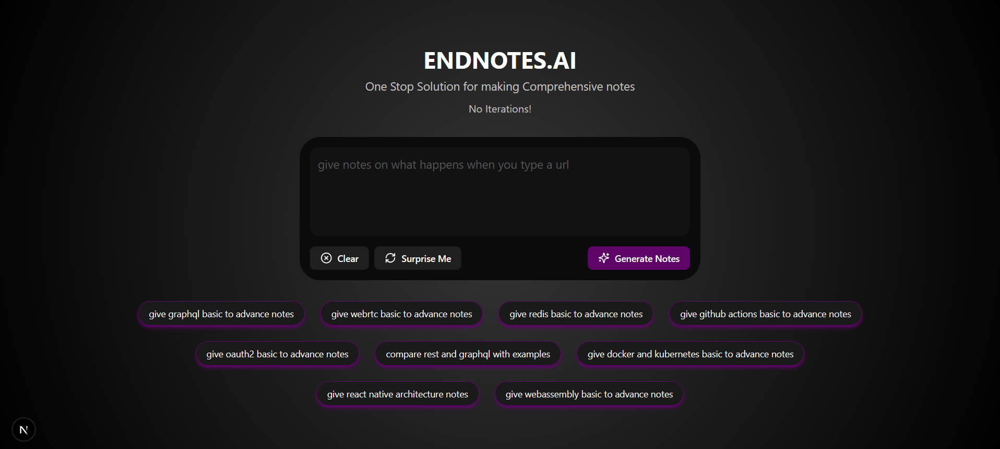

# 🧠 EndNotes.AI

> Generate concise, AI-powered notes from any topic or prompt in seconds.

**EndNotes.AI** is a sleek, dark-themed web app that lets users input a topic and instantly generate structured notes using AI. Built with **Next.js**, **TypeScript**, and a beautiful UI, it offers a smooth, interactive experience inspired by apps like Bolt and Notion AI.

---

## 🚀 Features

- 🎯 Prompt-based AI note generation
- 🎨 Typing animation and suggestion buttons (like "Surprise Me")
- 📄 Interactive chat UI with LLM-style responses
- 💾 LocalStorage-based prompt persistence
- ✨ Clean dark UI with professional components
- ⚙️ Built with modular and reusable components

---

## 🛠️ Tech Stack

- [Next.js 14](https://nextjs.org/)
- [TypeScript](https://www.typescriptlang.org/)
- [Tailwind CSS](https://tailwindcss.com/)
- [Lucide Icons](https://lucide.dev/)
- [LocalStorage](https://developer.mozilla.org/en-US/docs/Web/API/Window/localStorage)
- [Gemini-API](https://github.com/gemini-api/gemini-api)

---

## 📸 Preview

> 

---

## 🧑‍💻 Getting Started

### 1. Clone the repo

```bash
git clone https://github.com/srisailamkakurala/endnotes.ai.git
cd endnotes.ai
```

### 2. Install dependencies

```bash
npm install
# or
yarn install
```

### 3. Start the dev server

```bash
npm run dev
```

App will be live at [http://localhost:3000](http://localhost:3000)

---

## 🔐 Environment Variables

No API keys are required for local development unless integrated with OpenAI/Gemini/etc. (Optional future setup)

---

## 📁 Folder Structure

```
endnotes.ai/
│
├── app/                # Pages and routing (Next.js App Router)
├── components/         # Reusable UI components (ChatUI, etc.)
├── lib/                # Utility files (prompt list, helpers)
├── public/             # Static assets
├── styles/             # Global styles (if needed)
└── README.md
```

---

## 📦 To-Do / Roadmap

- [ ] Integrate real-time AI backend (OpenAI / Gemini)
- [ ] Downloadable notes (PDF/Markdown export)
- [ ] Shareable note links
- [ ] User authentication (optional)
- [ ] Mobile responsiveness
- [ ] Prompt history + edit feature

---

## 💻 Contributing

1. Fork the repository
2. Create a new branch: `git checkout -b feat/your-feature-name`
3. Make your changes
4. Submit a pull request 🙌

---

## 📜 License

MIT License © 2025 [Sri](https://github.com/srisailamkakurala)

---

## ☕ Support

If you like this project, consider [buying me a coffee](https://buymeacoffee.com/srisailam)!


